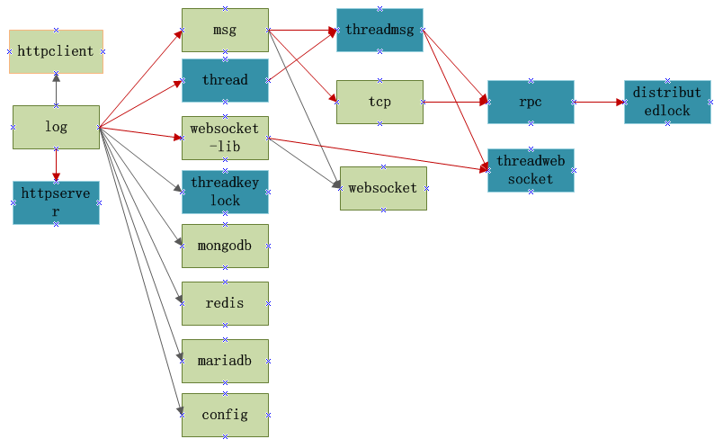
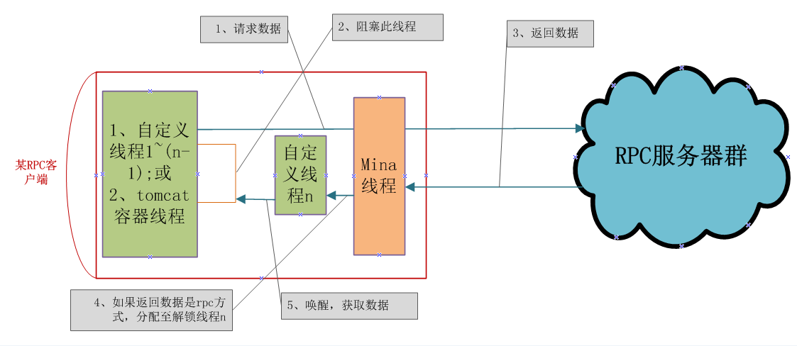
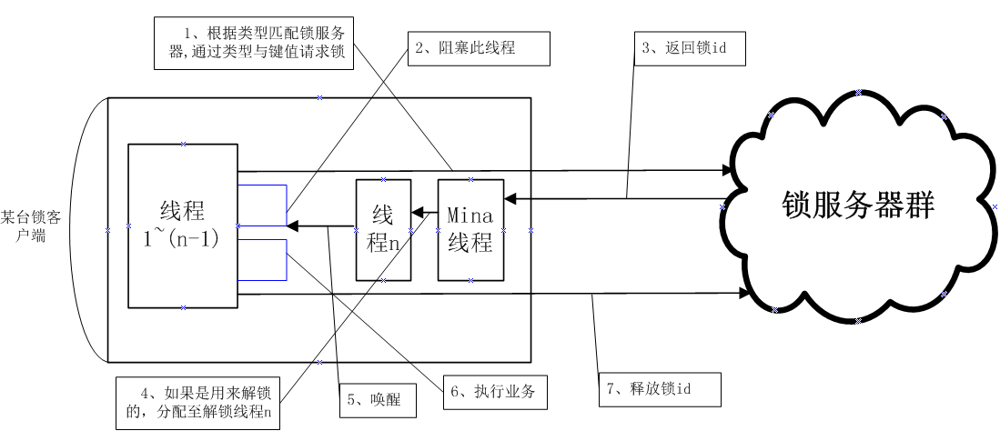
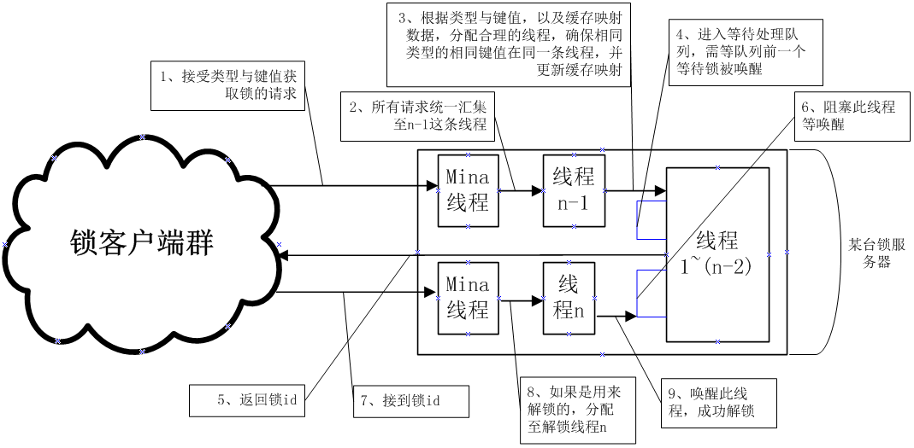

# grain

### 答疑、问题反馈QQ群：537982451

### grain是一个颗粒化RPC框架，可与任何框架整合。同时包含多对多关系的分布式锁、基于servlet的httpserver、websocket、系统多线程模型、多线程锁等组件，按需选择组件，不绑架开发者。

## grain架构图（深颜色是核心组件强烈推荐，具有不错的特性）

### 注意：如果一台服务器已经承担分布式锁服务器的角色，就不要用该服务器承担别的角色，因为这台服务器每个线程会等待锁客户端释放锁而阻塞线程。

### 开发者可根据项目情况按需选择组件，例如：

>1、grain-thread（系统多线程模型）。依赖：grain-log

>2、grain-threadmsg（系统多线程模型，线程消息通讯）。依赖：grain-thread，grain-msg

>3、grain-rpc（远程对象访问）。依赖：grain-threadmsg，grain-tcp

>4、grain-distributedlock（多对多关系的分布式锁）。依赖：grain-rpc

>5、grain-threadwebsocket（websocket服务器，使用系统多线程模型处理业务）。依赖：grain-websocket-lib，grain-threadmsg

>6、grain-httpserver（基于servlet的http服务器）。依赖：grain-log

>7、grain-threadkeylock（支持锁类型单键值与双键值的多线程锁）。依赖：grain-log

### github地址：

https://github.com/dianbaer/grain

### 码云地址：

https://gitee.com/dianbaer/grain

### 基于grain开发的项目

anyupload是一个极度纯净的上传插件，通过简单调整就可以融入到任何项目，支持多文件上传、上传速率动态控制、真实进度监控kb/s、分块生成MD5、分块上传、MD5校验秒传、暂停、取消等。

https://github.com/dianbaer/anyupload

https://gitee.com/dianbaer/anyupload

anychat是一个极简纯净的websocket聊天插件，支持对接任何身份系统、组织架构，嵌入方只需提供三个API即可进行实时通讯，支持个人与个人聊天、群聊天等。

https://github.com/dianbaer/anychat

https://gitee.com/dianbaer/anychat

startpoint是一个身份系统，提供用户、树形结构组、token等API。

https://github.com/dianbaer/startpoint

https://gitee.com/dianbaer/startpoint

## 核心组件介绍

### 1、grain-thread（系统多线程模型）

	grain最核心的组件，支撑起上层很多组件包含threadmsg（线程消息通讯）、
	rpc（远程对象访问）、distributedlock（多对多关系的分布式锁）、threadwebsocket（websocket服务器）。
	
	grain-thread支持创建多线程池，业务轮询精准注入指定线程ID，任意消息（例如：msg、tcp、websocket等）精准注入指定线程ID。

[grain-thread-详细介绍](./grain-thread)

---

### 2、grain-threadmsg（系统多线程模型，线程消息通讯）

	系统多线程之间的通讯，业务线程跳转都依赖此组件。

	
[grain-threadmsg-详细介绍](./grain-threadmsg)

---

### 3、grain-rpc（远程对象访问）

	通过grain-rpc可以创建RPC客户端与服务器进行远程对象访问。多线程阻塞，唤醒等复杂的多线程业务都已内部解决。
	
	
RPC客户端

RPC服务器

	
	
>简单例子：
	
	
	1、创建消息包
	RPCTestC.Builder builder = RPCTestC.newBuilder();
	builder.setName("RPC你好啊");
	TcpPacket pt = new TcpPacket(TestTCode.TEST_RPC_C, builder.build());
	2、远程调用
	TcpPacket ptReturn = WaitLockManager.lock(session, pt);
	

>例子（包含RPC客户端与RPC服务器，直接运行main函数即可）：

[grain-rpc-clienttest](./grain-rpc-clienttest)

[grain-rpc-servertest](./grain-rpc-servertest)

[grain-rpc-详细介绍](./grain-rpc)

---

### 4、grain-distributedlock（多对多关系的分布式锁）

	去中心化思路，通过grain-distributedlock可以创建分布式锁服务器与锁客户端。
	grain-distributedlock不同类型互不影响，相同类型不同键值互不影响。仅仅当类型与键值都相等时会进行分布式阻塞。
	锁客户端与锁服务器的双向线程阻塞，服务器匹配、类型键值与线程ID的匹配都已内部解决。

锁客户端

锁服务器

	

>简单例子：

	// 获取锁
	int lockId = DistributedLockClient.getLock("111", "user");
	if (lockId == 0) {
		return;
	}
	/*********** 执行分布式锁业务逻辑 *********/
	System.out.println("分布式锁id为：" + lockId);
	/*********** 执行分布式锁业务逻辑 *********/
	// 释放锁
	DistributedLockClient.unLock("111", "user", lockId);
	
	
>例子（包含分布式锁客户端与服务器，直接运行main函数即可）：

[grain-distributedlock-clienttest](./grain-distributedlock-clienttest)

[grain-distributedlock-servertest](./grain-distributedlock-servertest)

[grain-distributedlock-详细介绍](./grain-distributedlock)

---

### 5、grain-threadwebsocket（websocket服务器创建）

	将grain-threadwebsocket包引入web工程，可以创建websocket服务器。
	（业务分发至系统多线程模型grain-thread，可以精准指派某业务归属线程ID）
	
	public class TestWSService implements IWSListener {
		@Override
		public Map<String, String> getWSs() throws Exception {
			HashMap<String, String> map = new HashMap<>();
			map.put("testc", "onTestC");
			return map;
		}
		public void onTestC(WsPacket wsPacket) throws IOException, EncodeException {
			TestC testc = (TestC) wsPacket.getData();
			wsPacket.putMonitor("接到客户端发来的消息：" + testc.getMsg());
			TestS.Builder tests = TestS.newBuilder();
			tests.setWsOpCode("tests");
			tests.setMsg("你好客户端，我是服务器");
			WsPacket pt = new WsPacket("tests", tests.build());
			Session session = (Session) wsPacket.session;
			session.getBasicRemote().sendObject(pt);
		}
	}

>例子（该例子内部含有js websocket客户端，使用tomcat启动即可）：

[grain-threadwebsocket-test](./grain-threadwebsocket-test)

[grain-threadwebsocket-详细介绍](./grain-threadwebsocket)

---

### 6、grain-httpserver（创建http服务器）

	定义关键字并统筹所有请求参数，进行数据格式化。支持文件与操作数据的隔离。
	支持post表单数据与json数据，支持表单文件，支持get拼接参数，支持扩展消息包过滤器，支持扩展请求回复类型。

	public class TestHttpService implements IHttpListener {
		@Override
		public Map<String, String> getHttps() {
			HashMap<String, String> map = new HashMap<>();
			map.put("1", "onTestC");//返回json
			map.put("2", "onFileC");//返回文件
			map.put("3", "onImageC");//返回图片
			map.put("4", "onStringC");//返回字符串
			map.put("5", "onReplyStringC");//返回自定义头消息字符串
			map.put("6", "onException");//异常返回
			return map;
		}
		public HttpPacket onTestC(HttpPacket httpPacket) throws IOException, EncodeException {
			GetTokenS.Builder builder = GetTokenS.newBuilder();
			builder.setHOpCode(httpPacket.gethOpCode());
			builder.setTokenId("111111");
			builder.setTokenExpireTime("222222");
			HttpPacket packet = new HttpPacket(httpPacket.gethOpCode(), builder.build());
			return packet;
		}
		public ReplyFile onFileC(HttpPacket httpPacket) throws IOException, EncodeException {
			File file = new File(HttpConfig.PROJECT_PATH + "/" + HttpConfig.PROJECT_NAME + "/k_nearest_neighbors.png");
			ReplyFile replyFile = new ReplyFile(file, "你好.png");
			return replyFile;
		}
		public ReplyImage onImageC(HttpPacket httpPacket) throws IOException, EncodeException {
			File file = new File(HttpConfig.PROJECT_PATH + "/" + HttpConfig.PROJECT_NAME + "/k_nearest_neighbors.png");
			ReplyImage image = new ReplyImage(file);
			return image;
		}
		public String onStringC(HttpPacket httpPacket) throws IOException, EncodeException {
			return "<html><head></head><body><h1>xxxxxxxxxxxx<h1></body></html>";
		}
		public ReplyString onReplyStringC(HttpPacket httpPacket) throws IOException, EncodeException {
			String str = "<html><head></head><body><h1>xxxxxxxxxxxx<h1></body></html>";
			ReplyString replyString = new ReplyString(str, "text/html");
			return replyString;
		}
		public void onException(HttpPacket httpPacket) throws HttpException {
			GetTokenS.Builder builder = GetTokenS.newBuilder();
			builder.setHOpCode("0");
			builder.setTokenId("111111");
			builder.setTokenExpireTime("222222");
			throw new HttpException("0", builder.build());
		}
	}

>例子（该例子内部含有js http客户端，使用tomcat启动即可）：

[grain-httpserver-test](./grain-httpserver-test)

[grain-httpserver-详细介绍](./grain-httpserver)

---

### 7、grain-threadkeylock（支持锁类型单键值与双键值的多线程锁）

	在多线程业务中，支持锁类型的单键值与双键值，并且支持锁函数
	
	
>简单例子1（锁函数）：当类型为TEST1，键值为111同时调用函数时，会进行锁定。
	
	
	public String lockFunction(Object... params) {}
	String str = (String) KeyLockManager.lockMethod("111", TEST1, (params) -> lockFunction(params), new Object[] { "222", 111 });
	
>简单例子2（锁函数）：当类型为TEST1，键值为111或222同时调用函数时，会进行锁定。

	
	String str = (String) KeyLockManager.lockMethod("111", "222", TEST1, (params) -> lockFunction(params), new Object[] { "222", 111 });
	

[grain-threadkeylock-详细介绍](./grain-threadkeylock)

---

## 其他组件介绍

[grain-log-详细介绍](./grain-log)

[grain-msg-详细介绍](./grain-msg)
	
[grain-tcp-详细介绍](./grain-tcp)

[grain-config-详细介绍](./grain-config)

[grain-reds-详细介绍](./grain-redis)

[grain-mongodb-详细介绍](./grain-mongodb)

[grain-mariadb-详细介绍](./grain-mariadb)	
	
[grain-websocket-详细介绍](./grain-websocket)

[grain-httpclient-详细介绍](./grain-httpclient)

## 打版本

	ant
	
## 依赖

	java8
	
