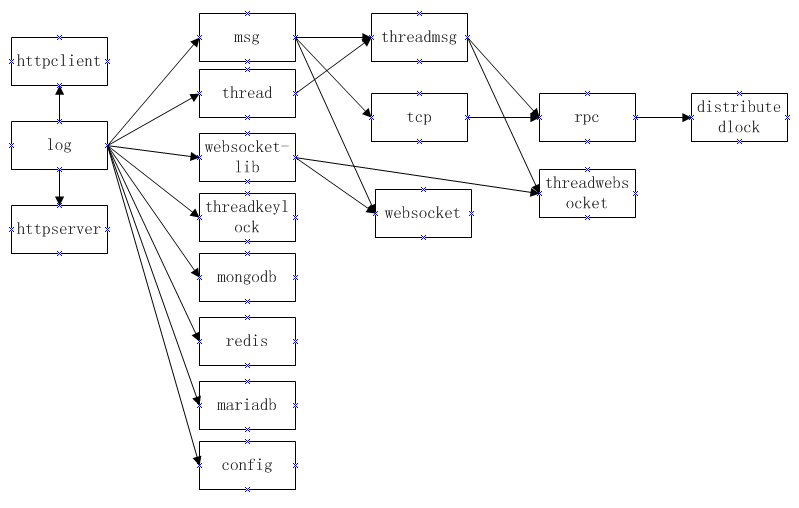

# grain

### grain是一个颗粒化RPC框架，同时包含多对多关系的分布式锁、基于servlet的httpserver、websocket、多线程模型、多线程锁等组件，按需选择组件，不绑架开发者。

## grain架构图（深颜色的组件是强烈推荐的，具有不错的特性）

### 开发者可根据项目情况按需选择组件，例如：

>1、distributedlock（多对多关系的分布式锁）。

>2、rpc（远程对象访问）。

>3、threadmsg（系统多线程模型，线程消息通讯）。

>4、threadkeylock（支持锁类型单键值与双键值的多线程锁）。

>5、httpserver（基于servlet的http服务器）。

>6、threadwebsocket（支持锁类型单键值与双键值的多线程锁）。

### github地址：

https://github.com/dianbaer/grain

### 码云地址：

https://gitee.com/dianbaer/grain

## 组件介绍

### 1、grain-log（日志接口）

	如果想打印日志，需要实现此日志接口并将实现的类的对象传递到各个组件初始化函数中。

	
[grain-log-了解更多](./grain-log)

---

### 2、grain-msg（通用消息）

	可进行消息的注册、监听、派发等功能。（当前线程）

	
[grain-msg-了解更多](./grain-msg)

---

### 3、grain-thread（系统多线程模型）

	grain最核心的组件，支撑起上层很多组件包含threadmsg（线程消息通讯）、rpc（远程对象访问）、distributedlock（多对多关系的分布式锁）。
	
	grain-thread支持创建多线程池，业务轮询精准注入指定线程ID，任意消息（例如：msg、tcp、websocket等）精准注入指定线程ID。

[grain-thread-了解更多](./grain-thread)

---

### 4、grain-threadmsg（线程消息通讯）

	系统多线程之间的通讯，业务线程跳转都依赖此组件。

	
[grain-threadmsg-了解更多](./grain-threadmsg)

---

### 5、grain-tcp（TCP客户端与服务器）

	通过grain-tcp可创建TCP客户端与服务器进行通讯，客户端支持断线重连。通讯消息序列化与反序列化，粘包问题等都已内部解决。

	
[grain-tcp-了解更多](./grain-tcp)

例子：grain-tcp-clienttest、grain-tcp-servertest直接运行main函数即可

---

### 6、grain-rpc（远程对象访问）

	通过grain-rpc可以创建RPC客户端与服务器进行远程对象访问。多线程阻塞，唤醒等复杂的多线程业务都已内部解决。
	
	
简单例子：
	
	
	1、创建消息包
	RPCTestC.Builder builder = RPCTestC.newBuilder();
	builder.setName("RPC你好啊");
	TcpPacket pt = new TcpPacket(TestTCode.TEST_RPC_C, builder.build());
	2、远程调用
	TcpPacket ptReturn = WaitLockManager.lock(session, pt);
	

[grain-rpc-了解更多](./grain-rpc)

例子：grain-rpc-clienttest、grain-rpc-servertest直接运行main函数即可

---

### 7、grain-distributedlock（多对多关系的分布式锁）

	去中心化思路，通过grain-distributedlock可以创建分布式锁服务器与锁客户端。
	grain-distributedlock不同类型互不影响，相同类型不同键值互不影响。仅仅当类型与键值都相等时会进行分布式阻塞。
	锁客户端与锁服务器的双向线程阻塞，服务器匹配、类型键值与线程ID的匹配都已内部解决。
	
简单例子：

	// 获取锁
	int lockId = DistributedLockClient.getLock("111", "user");
	if (lockId == 0) {
		return;
	}
	/*********** 执行分布式锁业务逻辑 *********/
	System.out.println("分布式锁id为：" + lockId);
	/*********** 执行分布式锁业务逻辑 *********/
	// 释放锁
	DistributedLockClient.unLock("111", "user", lockId);
	
	
[grain-distributedlock-了解更多](./grain-distributedlock)

例子：grain-distributedlock-clienttest、grain-distributedlock-servertest直接运行main函数即可

---
	
### 8、grain-config（通用配置加载管理）

	
	grain-config可以进行配置的加载，管理等工作。支持模板类文件与json文件。

[grain-config-了解更多](./grain-config)

---

### 9、grain-threadkeylock（支持锁类型单键值与双键值的多线程锁）

	在多线程业务中，支持锁类型的单键值与双键值，并且支持锁函数
	
	
简单例子1（锁函数）：当类型为TEST1，键值为111同时调用函数时，会进行锁定。
	
	
	public String lockFunction(Object... params) {}
	String str = (String) KeyLockManager.lockMethod("111", TEST1, (params) -> lockFunction(params), new Object[] { "222", 111 });
	
简单例子2（锁函数）：当类型为TEST1，键值为111或222同时调用函数时，会进行锁定。

	
	String str = (String) KeyLockManager.lockMethod("111", "222", TEST1, (params) -> lockFunction(params), new Object[] { "222", 111 });
	

[grain-threadkeylock-了解更多](./grain-threadkeylock)

---

### 10、grain-reds、grain-mongodb、grain-mariadb（持久与缓存）

	更简洁的操作redis、mongodb、mariadb。
	
	
[grain-reds-了解更多](./grain-redis)

[grain-mongodb-了解更多](./grain-mongodb)

[grain-mariadb-了解更多](./grain-mariadb)

---

### 11、grain-websocket（websocket服务器创建）

	将grain-websocket包引入web工程，可以创建websocket服务器。（业务基于容器线程，例如tomcat线程）
	
	
[grain-websocket-了解更多](./grain-websocket)

例子：grain-websocket-test

---

### 12、grain-threadwebsocket（websocket服务器创建）

	将grain-threadwebsocket包引入web工程，可以创建websocket服务器。（业务分发至系统多线程模型grain-thread，可以精准指派某业务归属线程ID）
	
	
[grain-threadwebsocket-了解更多](./grain-threadwebsocket)

例子：grain-threadwebsocket-test

---

### 13、grain-httpserver（创建http服务器）

	基于servlet的http服务器，简化http请求
	
[grain-httpserver-了解更多](./grain-httpserver)

例子：grain-httpserver-test

---

## 打版本

	ant
	
## 依赖

	java8